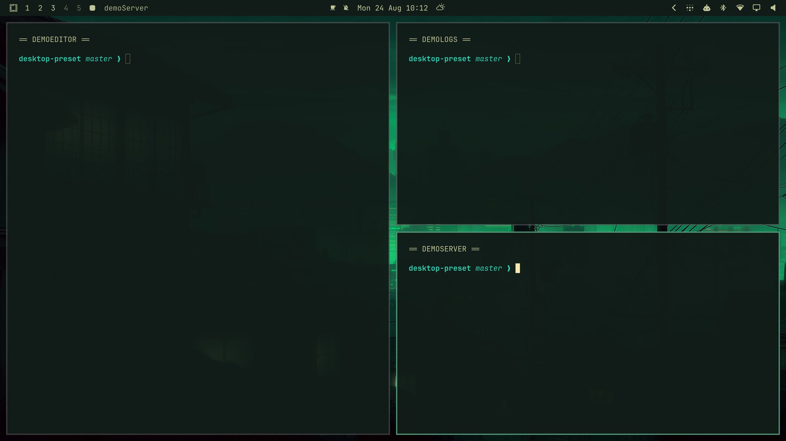
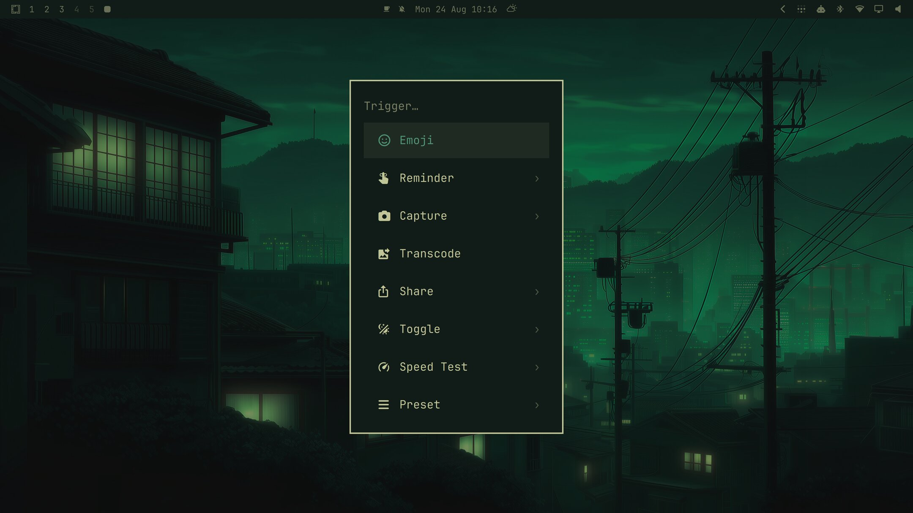
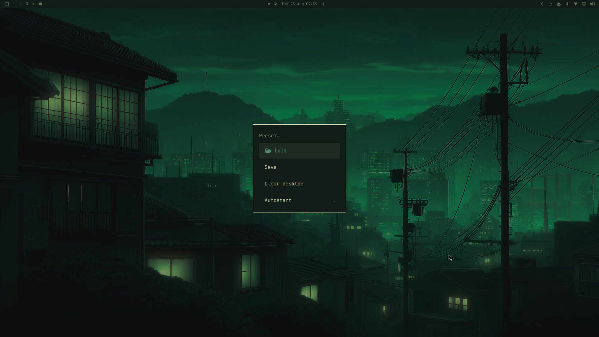
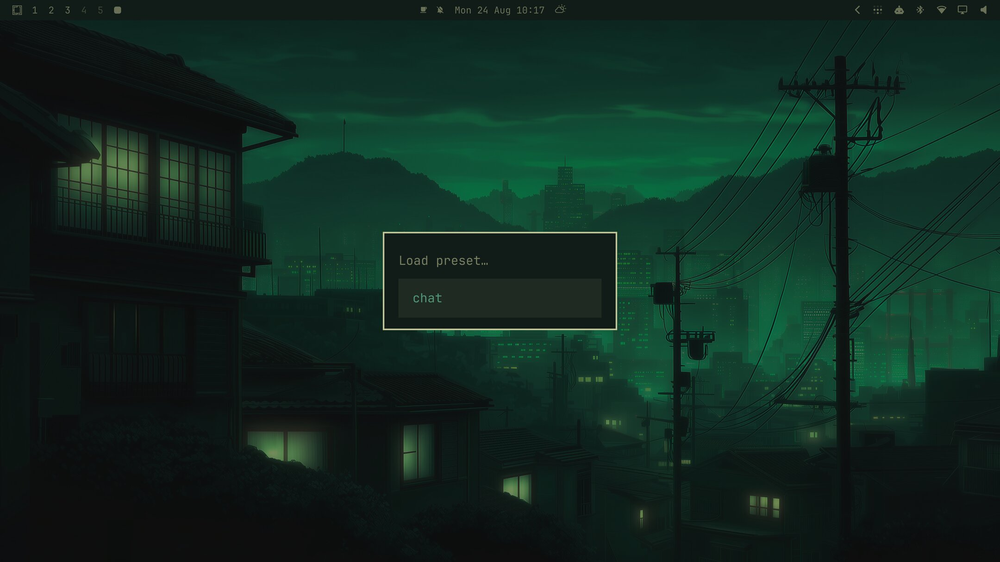
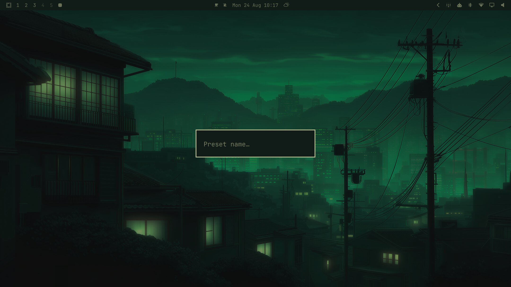
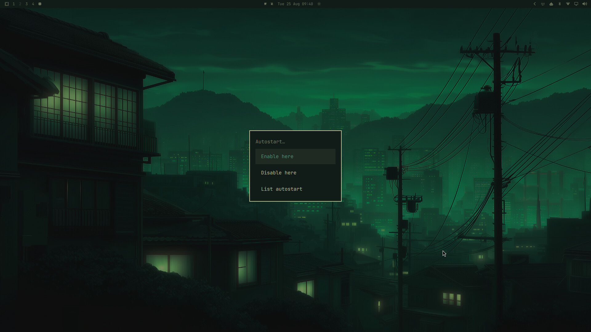
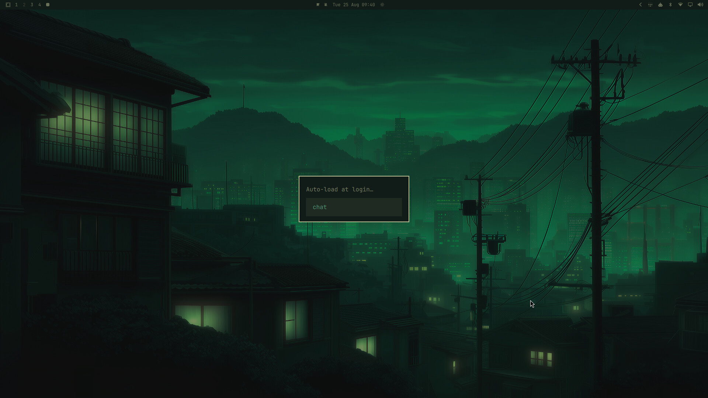

# desktop_preset

Save the exact arrangement of windows on a Hyprland workspace — which apps,
where, and how the screen is split between them — and restore it later with
one command or from the Omarchy menu.

```
$ desktop_preset save chat
$ desktop_preset load chat
```

Built for [Omarchy](https://omarchy.org/). Not a Quickshell "shell plugin"
(the ones you install with `omarchy plugin clone`) — it's a couple of CLI
scripts plus one entry added to your Omarchy menu.

## Demo



Three terminals, back exactly as arranged — same split shape, same
sides — after `desktop_preset clear` wiped the workspace and
`desktop_preset load demo` rebuilt it.

### From the menu

No terminal needed — everything below runs from **Menu → Trigger → Preset**.

| | |
|---|---|
|  `omarchy menu` → Trigger, with Preset listed |  The Preset submenu: Load / Save / Clear desktop / Autostart |
|  Load — picks from your saved presets |  Save — names the current workspace's layout |
|  Autostart — Enable here / Disable here / List autostart |  Enable here — picks which preset this workspace auto-loads at login |

## Why

Omarchy's `dwindle` layout (the default tiling layout) has no built-in way
to save an arrangement of windows and get it back later. `desktop_preset`
reconstructs the actual split tree from each window's saved position and
size, and replays it with Hyprland's `preselect` primitive — the same
mechanism Hyprland itself uses to control which side a new window lands on.

That works for any shape dwindle can produce, not just the two-app or
three-app case — a single window, a one-window-plus-a-stack layout, a
plain 2×2 grid, or any other split — reproducing the *exact* shape, not
just "these apps, roughly arranged." The one real cap is 10 windows; see
[Limitations](#limitations).

## Install

```
git clone <this-repo> && cd omarchy-desktop-preset
./install.sh
```

This copies the scripts to `~/.local/bin`, creates `~/.config/desktop_preset`,
adds a **Preset** entry under **Trigger** in your Omarchy menu, and wires up
login autostart via `~/.config/hypr/autostart.lua` (safe to re-run — it won't
duplicate the menu entry or the autostart line if they're already there).

To remove it:

```
./uninstall.sh           # removes scripts, menu entries, and autostart wiring
./uninstall.sh --purge   # also deletes ~/.config/desktop_preset (your presets)
```

Your saved presets are left in place by default so a reinstall doesn't lose
them.

### Dependencies

- **Omarchy 4.0+** on **Hyprland 0.56+**. Built and tested against Omarchy
  `4.0.0-1` / Hyprland `0.56.2`. The dispatches this relies on
  (`hl.dsp.window.move`, `hl.dsp.layout("preselect …")`) use Hyprland's Lua
  dispatch syntax — older Hyprland/Omarchy builds that only understood the
  legacy string-form dispatches (`movetoworkspacesilent 9,address:0x..`)
  will error out. If `desktop_preset load` fails immediately with a dispatch
  syntax error, that's almost certainly why — please open an issue with your
  `omarchy version` and `hyprctl version` output.
- `jq`, `python3` (for the split-tree inference — see below)
- The `omarchy` CLI (ships with Omarchy)

## Usage

```
desktop_preset list                     # show saved presets and their apps
desktop_preset save <name>              # save the current workspace
desktop_preset save <name> --force      # overwrite an existing preset
desktop_preset load <name>              # load onto the current workspace
desktop_preset load <name> -w 3         # load onto workspace 3
desktop_preset load <name> --clear      # close what's there first (asks)
desktop_preset clear                    # just close everything here
desktop_preset show <name>              # print the raw preset file
desktop_preset edit <name>              # open it in $EDITOR
```

Add `-n`/`--dry-run` to any `load`/`clear` to see what would happen without
doing it. Run `desktop_preset --help` for the full flag list.

From the desktop: open the Omarchy menu → **Trigger → Preset → Load / Save /
Clear desktop**. Each pops its own picker (no terminal needed) and reports
the result as a notification.

## Auto-load at login

Pin a preset to a workspace and it loads automatically the next time you log
in — handy for a "chat" or "work" arrangement you always want in the same
place, without running anything by hand.

```
desktop_preset autostart set chat -w 3   # workspace 3 loads 'chat' at login
desktop_preset autostart list            # see what's configured
desktop_preset autostart unset -w 3      # stop auto-loading on workspace 3
```

Or from the desktop: **Menu → Trigger → Preset → Autostart → Enable here /
Disable here** (uses whichever workspace you're on) and **List autostart**.

`./install.sh` wires the login side up for you, adding
`o.launch_on_start("desktop-preset-autostart")` to
`~/.config/hypr/autostart.lua` (safe to re-run, same as the menu entry). At
login this runs `desktop_preset autostart run`, which loads every configured
workspace — skipping any workspace that already has windows on it rather
than closing them, so it won't clobber anything if you trigger it by hand
mid-session. The mapping itself lives in
`~/.config/desktop_preset/autostart.conf` (`<workspace>=<preset>`, one per
line).

## How a preset is stored

Presets live in `~/.config/desktop_preset/<name>.preset` — plain text, safe
to hand-edit:

```
org.telegram.desktop         | uwsm-app -- Telegram
web.whatsapp.com             | omarchy-launch-webapp https://web.whatsapp.com/
spotify_player                | omarchy-launch-tui spotify_player

@anchor org.telegram.desktop
@split org.telegram.desktop r spotify_player
@split org.telegram.desktop d web.whatsapp.com
```

- `<pattern> | <command>` — one per app. `pattern` is matched against each
  window's class or title (same rule Omarchy's own launcher uses); `command`
  is how to launch it if it isn't already open.
- `@anchor <pattern>` — the window placed first, alone.
- `@split <focus> <dir> <new>` — split `<focus>`'s slot (`r`ight or `d`own),
  placing `<new>` there. One line per window after the anchor, in build
  order. This is the literal split tree, written by `save` — see
  `bin/desktop-preset-layout` for the reconstruction algorithm.
- `@float <pattern> <x> <y> <w> <h>` — exact position/size for a floating
  window.
- `@close-terminal` — if present, `load` closes the terminal it was run
  from once loading finishes (handy when triggering a preset from a
  terminal you don't want left open).

`save` falls back to plain reading order (no `@anchor`/`@split`) when two
windows on the workspace share the same pattern — their identity is
ambiguous, so there's nothing reliable to build a tree from — or with more
than 10 windows.

## Limitations

- **`dwindle` layout only.** Hyprland's `master` layout and the
  `scrolling` toggle build their arrangement differently; this hasn't been
  tested against either.
- **Ambiguous window identity.** Two windows with the same generic class and
  no distinguishing title (e.g. two plain terminals) can't be told apart —
  `save` detects this and falls back to plain ordering rather than guessing.
- Single-workspace, single-monitor arrangements. Multi-monitor workspace
  layouts aren't something this has been exercised against.

## License

MIT — see [LICENSE](LICENSE).
